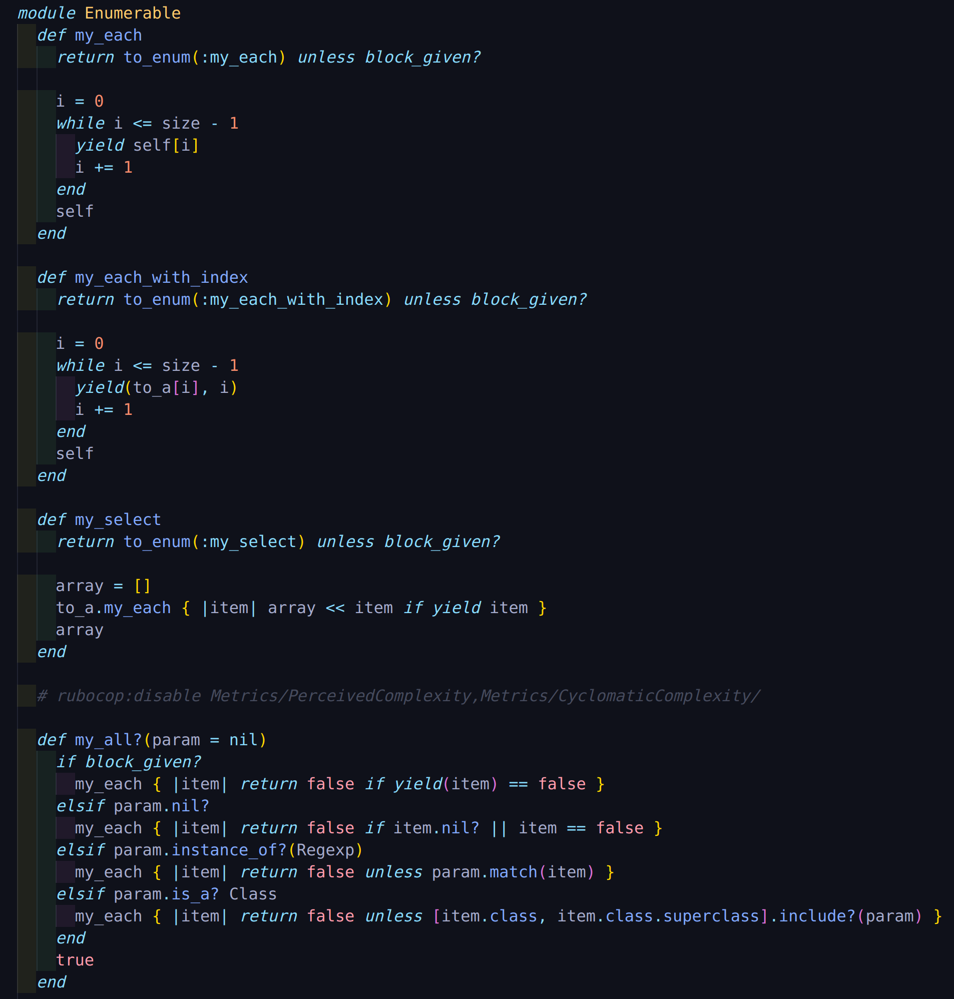

# Advanced Building Blocks - Enumerable Methods

> A Microverse project about enumerables.

Additional description about the project and its features.

### Screenshot

## Built With

- RUBY

## Authors

👤 **Ryel Banfield**

- GitHub: [@RyelBanfield](https://github.com/RyelBanfield)
- Twitter: [@RyelBanfield](https://twitter.com/RyelBanfield)
- LinkedIn: [RyelBanfield](https://www.linkedin.com/in/ryel-banfield-93a6a71b4/)

👤 **Mert Gündüz**

- GitHub: [@Mert Gündüz](https://github.com/mgunduz1)
- LinkedIn: [Mert Gündüz](https://www.linkedin.com/in/mert-gunduz-875280202/)

## Show your support!

Give a ⭐️ if you like this project!

## Acknowledgments

- Hat tip to anyone whose code was used
- Inspiration

## 📝 License

This project is [MIT](LICENSE) licensed.
